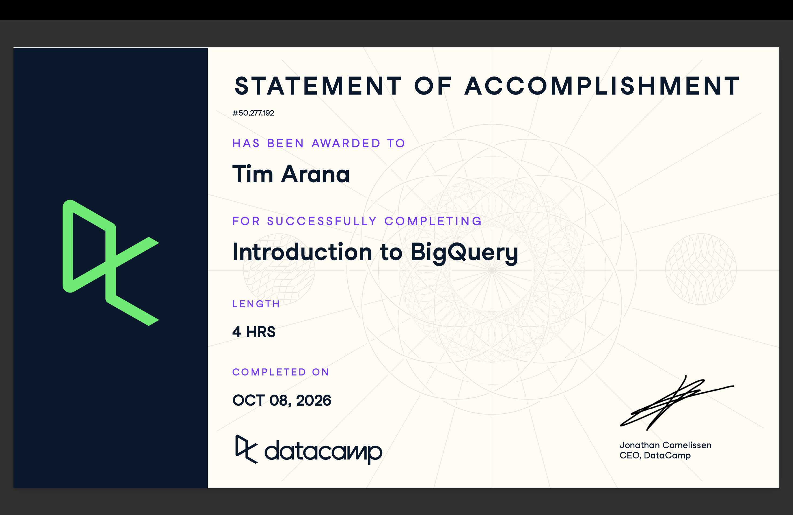

# Course-Completion Evidence

I successfully completed DataCamp's **Introduction to BigQuery** course on October 8, 2026. The course covered four hours of BigQuery concepts, querying techniques, data management, and optimization.



# Learning Notes and Key Takeaways

These notes summarize the main concepts, procedures, and GoogleSQL techniques I learned throughout the Introduction to BigQuery course. I organized them as a practical reference that I can return to when working with larger datasets in future coursework and my Culminating Experience Project (CEP).

## Introducing BigQuery

### Main Ideas

BigQuery is Google's cloud-based data warehouse designed for analyzing large datasets. One of the main differences between BigQuery and a traditional SQL database is that BigQuery separates storage and computing resources. This allows large analytical queries to scale without having to manage the underlying infrastructure myself.

BigQuery is best suited for analytical workloads rather than transactional workloads. This makes it useful when I need to analyze large amounts of historical data, create reports, or explore patterns across datasets.

### BigQuery Terminology and Procedures

Some important concepts from this section were:

- **Colossus:** BigQuery's distributed storage system.
- **Capacitor:** Stores BigQuery data in a columnar format.
- **Dremel:** The query execution engine.
- **Jupiter:** Google's network infrastructure that helps move data between storage and compute resources.
- **Slots:** Units of computational capacity used to execute queries.
- **Projects:** The highest organizational level for BigQuery resources.
- **Datasets:** Containers within projects that hold tables.
- **Tables:** Store the actual rows and columns of data.

The basic BigQuery data hierarchy is:

**Project → Dataset → Table**

I also learned that data location matters. Tables and datasets should be placed in an appropriate region because queries involving data across different regions can create limitations.

### Important SQL Syntax

A basic BigQuery query follows familiar SQL syntax:

```sql
SELECT *
FROM `project_name.dataset_name.table_name`
LIMIT 10;
```

In this example:

- `project_name` identifies the Google Cloud project.
- `dataset_name` identifies the dataset within the project.
- `table_name` identifies the specific table.
- `LIMIT 10` restricts the output to ten rows.

### Example

One of the course exercises explored an e-commerce table:

```sql
SELECT *
FROM ecommerce.ecomm_order_details
LIMIT 3;
```

### Explanation

This query retrieves all columns from `ecomm_order_details` but returns only three rows. Using `LIMIT` is useful when I first explore a table because I can inspect its structure and values without returning an unnecessarily large result.

### CEP Application

BigQuery could be useful for a CEP involving large amounts of marketing or customer data. For example, campaign activity, website behavior, transactions, or other digital engagement data could be organized into datasets and tables. I could then query those tables to explore customer behavior and campaign performance without needing to load an entire large dataset into a local program.

## Organizing and Querying BigQuery Data

### Main Ideas

BigQuery organizes data using projects, datasets, and tables. Understanding this structure is important because queries need to reference the correct dataset and table, and access can differ across resources.

I also learned that the geographic location of BigQuery data matters. Datasets are created in specific regions or multi-regions, so it is important to plan where data will be stored before beginning an analysis.

### BigQuery Terminology and Procedures

- A **project** organizes BigQuery resources and can contain multiple datasets.
- A **dataset** is a container for related tables.
- A **table** contains the actual data being queried.
- Tables from different datasets can be queried together when the necessary access and location requirements are satisfied.
- It is recommended to load tables into the region where the analysis will be performed.
- BigQuery supports querying structured data as well as more complex and nested data structures.

### Important SQL Syntax

`DISTINCT` can be used when I only want unique values from a column.

```sql
SELECT DISTINCT seller_city
FROM ecommerce.ecomm_sellers;
```

Tables can also be joined when information is distributed across multiple tables:

```sql
SELECT
    ecomm_orders.order_id,
    ecomm_orders.order_items,
    ecomm_order_details.order_status,
    ecomm_order_details.order_purchase_timestamp
FROM ecommerce.ecomm_orders
JOIN ecommerce.ecomm_order_details USING (order_id)
ORDER BY order_purchase_timestamp DESC
LIMIT 10;
```

### Explanation

The first query returns each unique seller city rather than returning the same city repeatedly.

The second query combines order information with order-detail information using the shared `order_id`. The results are ordered by purchase timestamp in descending order so that the most recent orders appear first.

These examples showed me that understanding how tables relate to each other is just as important as knowing individual SQL commands.

### CEP Application

Marketing and CEP data may be distributed across multiple tables. For example, one table might contain customer information while another contains engagement or transaction activity. Understanding BigQuery's organization and joins would allow me to connect these sources and create an analysis dataset containing only the variables needed for a specific Analytics Objective.

## Loading Data into BigQuery

### Main Ideas

BigQuery can work with several common data formats and provides different ways to load data depending on where the source files are stored. Choosing an appropriate file format and loading method is important when preparing data for analysis.

I learned that loading local files has additional limitations compared with loading data from cloud storage. For larger workflows, cloud-based data sources can be more practical than repeatedly uploading files from a local computer.

### BigQuery Terminology and Procedures

BigQuery supports several file formats, including:

- CSV
- JSON
- Avro
- ORC
- Parquet

XML was not included as one of the supported file types in the course exercise.

The course also demonstrated that data stored in Google Cloud Storage can be loaded into BigQuery using a Cloud Storage URI. A URI beginning with `gs://` identifies the location of a file in a Google Cloud Storage bucket.

### Important SQL Syntax

The `LOAD DATA` statement can load data from an external file into a BigQuery table.

```sql
LOAD DATA INTO mydataset.table
FROM FILES(
  format = 'CSV',
  uris = ['gs://bucket/path/file.csv']
);
```

### Example

In this example:

- `mydataset.table` represents the destination dataset and table.
- `format = 'CSV'` tells BigQuery what type of file is being loaded.
- `gs://bucket/path/file.csv` represents the location of the source file in Google Cloud Storage.

### Explanation

The `LOAD DATA` statement provides a SQL-based way to bring externally stored data into BigQuery. This is useful because an analysis often begins with data that exists outside the warehouse.

I also learned that local-file loading and cloud-storage loading are not identical. Understanding where the source data is located helps determine which loading method is appropriate.

### CEP Application

For a CEP, data might come from survey exports, customer records, campaign reports, or other external sources. Knowing how BigQuery accepts common formats such as CSV and JSON would help me move these datasets into a centralized environment before cleaning, joining, and analyzing them.

## Working with Dates and Timestamps

### Main Ideas

BigQuery provides functions for extracting, formatting, comparing, and modifying dates and timestamps. These functions are useful when analyzing behavior over specific time periods, such as days, months, quarters, or campaign windows.

I learned that timestamp functions make it possible to answer questions such as how many orders occurred during a particular month, what happened before or after an event, and how long ago an event occurred.

### BigQuery Terminology and Procedures

Important functions from this section included:

- `EXTRACT()` to retrieve a specific component such as a date, month, quarter, or year.
- `FORMAT_TIMESTAMP()` to display timestamps in a chosen format.
- `TIMESTAMP_ADD()` to move forward from a timestamp by a specified interval.
- `TIMESTAMP_SUB()` to move backward from a timestamp.
- `CURRENT_TIMESTAMP()` and `CURRENT_DATE()` to reference the current time or date.
- `DATE_DIFF()` to calculate the difference between dates.

### Important SQL Syntax

For example, I can extract a month from a timestamp:

```sql
SELECT COUNT(order_id)
FROM ecommerce.ecomm_order_details
WHERE EXTRACT(MONTH FROM order_purchase_timestamp) = 9;
```

I can also filter by both quarter and year:

```sql
SELECT COUNT(order_id)
FROM ecommerce.ecomm_order_details
WHERE EXTRACT(QUARTER FROM order_purchase_timestamp) = 4
  AND EXTRACT(YEAR FROM order_purchase_timestamp) = 2017;
```

### Example: Creating a Time Window

The course used Black Friday as an example of analyzing activity around a specific date:

```sql
SELECT COUNT(order_id)
FROM ecommerce.ecomm_order_details
WHERE order_purchase_timestamp BETWEEN
  TIMESTAMP_SUB(TIMESTAMP('2017-11-24'), INTERVAL 3 DAY)
  AND
  TIMESTAMP_ADD(TIMESTAMP('2017-11-24'), INTERVAL 3 DAY);
```

### Explanation

This query creates a window extending three days before and three days after November 24, 2017. `TIMESTAMP_SUB()` establishes the beginning of the period, while `TIMESTAMP_ADD()` establishes the end.

I also practiced formatting timestamps:

```sql
SELECT
  FORMAT_TIMESTAMP('%m/%d/%y', order_purchase_timestamp) AS order_date,
  order_id
FROM ecommerce.ecomm_order_details
LIMIT 3;
```

The format codes `%m`, `%d`, and `%y` display the timestamp as month/day/two-digit year.

### CEP Application

Date and timestamp functions could be especially useful for digital marketing analysis. I could compare customer behavior before, during, and after a campaign, analyze engagement by month or quarter, or create windows around important marketing events. These functions could also help measure whether customer activity changes after a particular intervention or communication.

## Arrays, Nested Data, and UNNEST

### Main Ideas

One feature of BigQuery that was newer to me was its ability to work with arrays and nested data. Instead of requiring every value to exist in a completely separate row or table, BigQuery can store multiple related values inside a single record.

To analyze individual elements inside an array, I learned to use `UNNEST()`. This converts the elements of an array into rows that can be queried individually.

### BigQuery Terminology and Procedures

Important concepts from this section included:

- **Array:** An ordered collection of values stored within a field.
- **Nested data:** Data structures that contain additional values or records inside them.
- `ARRAY()` creates an array from query results.
- `ARRAY_LENGTH()` returns the number of elements in an array.
- `UNNEST()` expands an array so its individual elements can be queried.
- Dot notation can access fields contained within nested records.
- `SEARCH()` can search values in semi-structured or unstructured data.

### Important SQL Syntax

One exercise used `UNNEST()` to expand the `order_items` array:

```sql
SELECT
  order_id,
  items
FROM ecommerce.ecomm_orders,
  UNNEST(order_items) AS items
WHERE order_id = 'a0e747c954a595b0e3458c87ab1a4958';
```

### Example: Accessing a Nested Field

After unnesting the array, dot notation can retrieve a specific field:

```sql
SELECT
  items.price,
  order_id
FROM ecommerce.ecomm_orders,
  UNNEST(order_items) AS items
WHERE order_id = 'a0e747c954a595b0e3458c87ab1a4958';
```

### Explanation

`UNNEST(order_items)` turns each element of the `order_items` array into a row. The alias `items` can then be used to access nested fields such as `items.price` or `items.product_id`.

This was important because some information cannot be queried like an ordinary top-level column until the nested structure is expanded.

### CEP Application

Nested data could appear in digital analytics or other large datasets where several related events or attributes are stored together. Understanding `UNNEST()` would allow me to extract individual values from those structures and turn them into rows that can be filtered, summarized, or joined with other tables.

## CTEs and Aggregate Functions

### Main Ideas

Common Table Expressions (CTEs) make complex queries easier to organize by creating temporary named result sets that can be referenced later in the same query. I practiced using CTEs to filter or summarize data first and then use those results in another query.

BigQuery also provides many aggregate functions for summarizing groups of observations. In addition to familiar functions such as `COUNT()`, `SUM()`, and `AVG()`, the course introduced functions for conditional counting, logical aggregation, combining strings and arrays, and approximate calculations.

### BigQuery Terminology and Procedures

Important functions and concepts included:

- `WITH` creates a Common Table Expression.
- `COUNTIF()` counts rows that satisfy a condition.
- `HAVING` filters results after aggregation.
- `ANY_VALUE()` returns a value from a group and can be combined with `HAVING MAX` or `HAVING MIN`.
- `LOGICAL_AND()` returns true when all values satisfy a condition.
- `LOGICAL_OR()` returns true when at least one value satisfies a condition.
- `STRING_AGG()` combines strings from multiple rows.
- `ARRAY_CONCAT_AGG()` combines arrays during aggregation.
- `APPROX_COUNT_DISTINCT()` estimates the number of unique values.
- `APPROX_TOP_COUNT()` estimates the most frequent values.
- `APPROX_QUANTILES()` divides numeric data into approximate quantiles.
- `APPROX_TOP_SUM()` identifies values associated with the largest approximate sums.

### Important SQL Syntax

A CTE can first filter data and then be used by the main query:

```sql
WITH orders AS (
  SELECT order_id
  FROM ecommerce.ecomm_orders,
       UNNEST(order_items) AS items
  WHERE items.price > 150
)

SELECT
  COUNT(order_id),
  order_status
FROM ecommerce.ecomm_order_details od
JOIN orders o USING (order_id)
GROUP BY order_status;
```

### Example: Conditional Aggregation

```sql
SELECT
  product_category_name_english,
  COUNTIF(product_weight_g > 5000)
FROM ecommerce.ecomm_products
GROUP BY product_category_name_english;
```

### Explanation

`COUNTIF()` counts only products whose weight is greater than 5,000 grams and reports the result for each product category.

I also learned that `WHERE` and `HAVING` serve different purposes. `WHERE` filters individual records before aggregation, while `HAVING` can filter groups based on an aggregate result.

For example:

```sql
SELECT
  product_category_name_english,
  AVG(product_weight_g)
FROM ecommerce.ecomm_products
GROUP BY product_category_name_english
HAVING AVG(product_weight_g) > 10000;
```

This keeps only categories whose average product weight exceeds 10,000 grams.

### CEP Application

CTEs could help organize a complicated CEP analysis into understandable stages. For example, I could first isolate a particular customer segment or campaign period in a CTE and then calculate engagement or performance metrics in the main query.

Aggregate functions would also be useful for summarizing marketing data by customer segment, campaign, channel, or other categories. Approximate functions could become useful when working with extremely large datasets where obtaining a fast estimate is more valuable than calculating an exact result.

## Window Functions and Analytical Queries

### Main Ideas

Window functions allow calculations across related rows without collapsing those rows into a single aggregated result. This makes them useful for rankings, comparisons between observations, and rolling calculations.

The course introduced functions such as `RANK()`, `LAG()`, and `LEAD()`, along with window frames that control which surrounding rows are included in a calculation.

### BigQuery Terminology and Procedures

Important concepts included:

- `OVER()` defines the window used by a window function.
- `PARTITION BY` separates the data into groups before applying the function.
- `ORDER BY` determines the sequence of rows within the window.
- `RANK()` assigns rankings based on a specified ordering.
- `LAG()` accesses a value from a previous row.
- `LEAD()` accesses a value from a following row.
- `ROWS BETWEEN` defines a specific row-based window.
- `PRECEDING` refers to rows before the current row.
- `FOLLOWING` refers to rows after the current row.
- `CURRENT ROW` refers to the current observation.
- `QUALIFY` filters results after a window function has been calculated.

### Important SQL Syntax

One exercise ranked customers by their total amount spent:

```sql
WITH orders AS (
  SELECT
    od.customer_id,
    SUM(items.price) AS all_items
  FROM ecommerce.ecomm_orders o,
       UNNEST(o.order_items) AS items
  JOIN ecommerce.ecomm_order_details od USING (order_id)
  GROUP BY od.customer_id
)

SELECT
  customer_id,
  all_items,
  RANK() OVER (ORDER BY all_items DESC) AS customer_rank
FROM orders
ORDER BY all_items DESC;
```

### Example: LAG and LEAD

```sql
SELECT
  od.customer_id,
  items.price,
  LAG(items.price) OVER(
    PARTITION BY od.customer_id
    ORDER BY od.order_purchase_timestamp
  ) AS lag,
  LEAD(items.price) OVER(
    PARTITION BY od.customer_id
    ORDER BY od.order_purchase_timestamp
  ) AS lead
FROM ecommerce.ecomm_orders o,
     UNNEST(o.order_items) AS items
JOIN ecommerce.ecomm_order_details od USING (order_id);
```

### Explanation

`LAG()` retrieves a value from an earlier row in the window, while `LEAD()` retrieves a value from a later row. Partitioning by customer keeps the comparisons within each customer's records.

The course also demonstrated rolling averages. For example:

```sql
AVG(item.price) OVER(
  ORDER BY order_purchase_timestamp
  ROWS BETWEEN 9 PRECEDING AND CURRENT ROW
) AS rolling_avg
```

This calculates an average using the current row and the previous nine rows.

`QUALIFY` can then filter the results of a window calculation:

```sql
QUALIFY rolling_avg > 500
```

Unlike `WHERE`, which filters records before the window calculation, `QUALIFY` can filter based on the result produced by the window function.

### CEP Application

Window functions could help analyze changes in customer behavior over time without losing individual observations. I could rank customers by engagement or value, compare current activity with previous activity, or calculate rolling measures around a marketing campaign. `QUALIFY` would then allow me to focus on customers or periods that meet specific analytical criteria.

## Joins and Data Manipulation

### Main Ideas

Joins allow information from different tables or query results to be combined based on related fields. The type of join determines which matching and nonmatching records are retained.

The course also introduced Data Manipulation Language (DML) concepts for changing data stored in BigQuery. These operations are different from ordinary `SELECT` queries because they can modify the contents of tables.

### BigQuery Terminology and Procedures

Important join types included:

- `INNER JOIN` returns only matching records from both sides.
- `LEFT JOIN` keeps all records from the left side and matching records from the right.
- `RIGHT JOIN` keeps all records from the right side and matching records from the left.
- `FULL OUTER JOIN` keeps matching and nonmatching records from both sides.
- `CROSS JOIN` creates combinations of records and can also be used with `UNNEST()` to expand nested arrays.
- `USING()` provides a concise way to join tables that share a column with the same name.

Important DML statements included:

- `INSERT` adds new records.
- `UPDATE` modifies existing records.
- `DELETE` removes records.
- `MERGE` can combine different modification actions based on matching conditions.

### Important SQL Syntax

A basic join using a shared `order_id` can be written as:

```sql
SELECT
  p.payment_installments,
  COUNT(p.order_id)
FROM ecommerce.ecomm_payments p
JOIN ecommerce.ecomm_order_details o USING (order_id)
GROUP BY p.payment_installments;
```

### Example: Joining After a CTE

```sql
WITH orders AS (
  SELECT
    o.order_id,
    item.product_id
  FROM ecommerce.ecomm_orders o,
       UNNEST(o.order_items) AS item
)

SELECT
  p.product_id,
  COUNT(o.order_id)
FROM orders o
JOIN ecommerce.ecomm_products p
USING (product_id)
GROUP BY p.product_id;
```

### Explanation

The CTE first extracts the individual product IDs from the nested order data. The main query then joins those results with the products table using `product_id` and counts the number of orders associated with each product.

This demonstrated how several BigQuery techniques can work together in one analysis: nested data can be unnested, organized through a CTE, joined to another table, and finally aggregated.

### CEP Application

Joins would be important if my CEP data is stored across multiple sources or tables. For example, customer information could be stored separately from activity or survey information. Joining those sources would allow me to create a more complete analytical dataset while preserving the variables needed for a specific objective.

## Query Efficiency and Optimization

One final lesson from the course was that efficient BigQuery queries should process only the data that is actually needed. Because BigQuery is designed for large datasets, unnecessary columns or records can increase the amount of data processed.

Some practices I learned include:

- Select only the columns needed instead of automatically using `SELECT *`.
- Filter unnecessary records when possible.
- Use appropriate joins and aggregations.
- Use approximate functions when an estimate is sufficient for a very large dataset.
- Use partitioning and clustering when appropriate to improve performance.

For example:

```sql
SELECT
  order_id,
  payment_type
FROM ecommerce.ecomm_payments
LIMIT 10;
```

This query requests only the two necessary columns instead of retrieving the entire table.

For a CEP, these practices could help keep queries more manageable when analyzing large customer, transaction, campaign, or digital-behavior datasets.

# Overall Reflection and Future Reference

## What were the most useful BigQuery concepts or procedures you learned?

The most useful concepts for me were understanding how BigQuery organizes data into projects, datasets, and tables and learning how to work with nested data using arrays and `UNNEST()`. I also found CTEs, joins, aggregate functions, and window functions useful because they make it possible to answer more complicated analytical questions while keeping queries organized.

## How is using BigQuery different from learning SQL syntax alone?

Learning SQL syntax focuses mainly on how to write queries, while BigQuery also requires understanding how data is stored, organized, loaded, and processed in a cloud environment. I had to think about datasets, tables, regions, nested data, and query efficiency in addition to writing SQL. BigQuery therefore feels more like working with an entire analytical environment rather than only learning a query language.

## Which concepts or procedures were most challenging?

Working with nested data was one of the more challenging parts. Using arrays, `UNNEST()`, aliases, and dot notation required me to think differently about how the data was structured. Window functions were also challenging at first because functions such as `LAG()`, `LEAD()`, and rolling averages depend on understanding partitions, ordering, and window frames.

## How could BigQuery support digital marketing analytics, customer insights, survey research, GA4 analysis, or my CEP?

BigQuery could support these areas by providing a central place to store and analyze large datasets. Marketing data from different sources could be organized into tables and joined together to study customer behavior, campaign performance, transactions, or engagement. For a CEP, BigQuery could help organize and query the variables needed for an Analytics Objective and create summarized data that could later be used for additional analysis or reporting.

## What concepts or query patterns do you expect to review again?

I expect to review `UNNEST()`, CTEs, window functions, `QUALIFY`, timestamp functions, and some of the BigQuery-specific aggregate functions. I will also want to review query optimization practices when working with larger datasets. These concepts were useful but involve enough syntax and structure that having this report as a reference should help me use them again.

# Appendix: Publication Links

- [GitHub Repository](https://github.com/tarana7/ibm-6500-sql-learning-portfolio)

- [Published Introduction to BigQuery Report](https://tarana7.github.io/ibm-6500-sql-learning-portfolio/introduction-to-bigquery.html)
