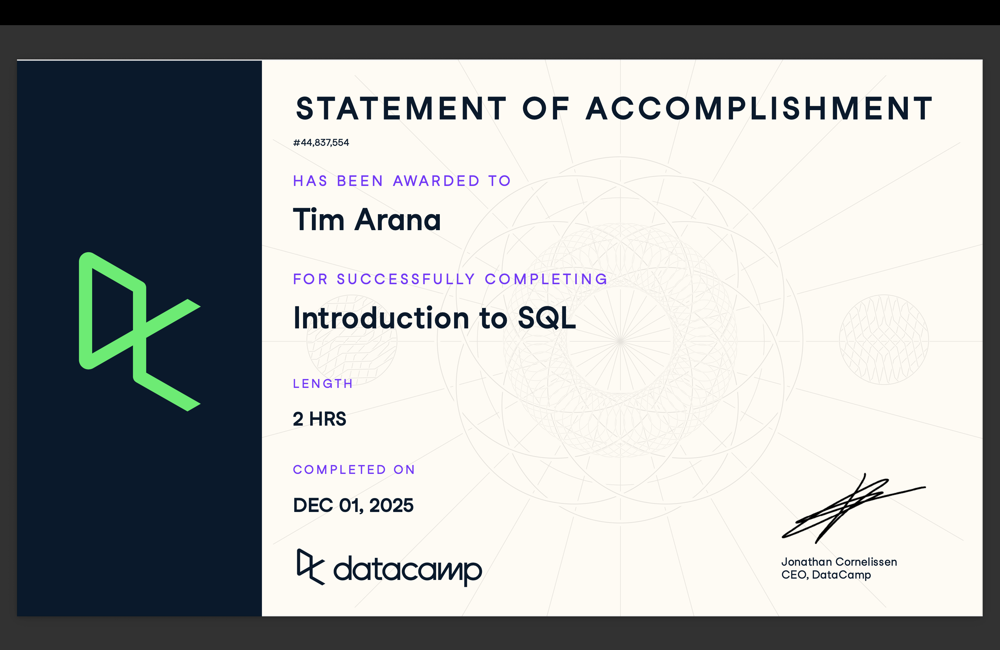

# Course-Completion Evidence

I completed the DataCamp **Introduction to SQL** course through the IBM 6500 DataCamp classroom. The course introduced foundational SQL concepts and provided practice with querying and working with relational data.

## Certificate

The image below provides evidence of my completion of the DataCamp Introduction to SQL course, completed on December 1, 2025.



# Learning Notes and Key Takeaways

## Relational Databases

### Main Ideas

This chapter helped me understand what relational databases are and how data is organized before writing SQL queries. A relational database stores information in tables made up of rows and fields. I learned that tables should be organized carefully so that data can be stored consistently and connected to other information when needed.

The chapter also introduced the importance of unique identifiers, naming tables and fields clearly, and choosing appropriate data types. Data types matter because different kinds of information, such as numbers and text, need to be stored differently. I also learned about the role of database servers in storing and providing access to data.

### Important Concepts

-   Relational databases
-   Tables, rows, and fields
-   Unique IDs
-   Table and field naming
-   Data types
-   Database servers
-   Organizing data consistently

### Example

A customer table could be organized with fields such as:

| customer_id | customer_name | age | email               |
|-------------|---------------|----:|---------------------|
| 1001        | Alex Smith    |  28 | alex\@example.com   |
| 1002        | Jordan Lee    |  35 | jordan\@example.com |

In this example, `customer_id` can serve as a unique identifier because each customer has a different value. The other fields store different pieces of information about each customer.

### CEP Application

Understanding database organization could help with my CEP because marketing data may come from multiple sources and contain many different variables. Using clearly organized tables, unique identifiers, and appropriate data types would make it easier to store customer, survey, website, or campaign data and prepare it for analysis.

## Querying

### Main Ideas

This chapter introduced the basic SQL commands used to retrieve information from database tables. I learned that `SELECT` specifies which fields I want to retrieve and `FROM` identifies the table containing those fields. Using `SELECT *` returns every field in a table, while selecting individual fields allows a query to focus only on the information needed.

I also learned how `DISTINCT` can remove duplicate values from query results and how aliases can give fields more readable names. The chapter discussed SQL style and showed that formatting queries clearly makes them easier to read and maintain. It also introduced SQL flavors, such as PostgreSQL and SQL Server, and showed that some syntax can vary between database systems.

### Important SQL Syntax

**Selecting specific fields**

``` sql
SELECT title, author
FROM books;
```

**Selecting all fields**

``` sql
SELECT *
FROM books;
```

**Returning unique values**

``` sql
SELECT DISTINCT author
FROM books;
```

**Creating an alias**

``` sql
SELECT title AS book_title
FROM books;
```

### Explanation of the Examples

The first query returns only the `title` and `author` fields from the `books` table. The second query uses `*` to return every field. The third uses `DISTINCT` so that each author appears only once in the results. The final query uses `AS` to display the `title` field under the more descriptive name `book_title`.

### CEP Application

These commands could help with a marketing or CEP project by allowing me to retrieve only the variables needed for a particular analysis. For example, I could select customer IDs and campaign-response variables from a larger database or use `DISTINCT` to identify unique categories, locations, products, or customer segments. Aliases could also make technical field names easier to understand in analysis outputs.

# Overall Reflection and Future Reference

## What were the most useful skills you learned?

The most useful skill I learned was how SQL can be used to retrieve specific information from a relational database. Understanding how `SELECT` and `FROM` work together gave me a foundation for writing queries. I also found `DISTINCT` and aliases useful because they can make query results cleaner and easier to understand.

## Which SQL concepts were most challenging?

One of the more challenging parts was understanding how databases should be organized before querying them. Concepts such as unique identifiers, data types, and the relationship between tables and fields are important because the structure of a database affects how easily the data can be used. I also need more practice remembering differences between SQL flavors.

## How could SQL support digital marketing analytics, customer insights, survey research, or your CEP?

SQL could support marketing analytics and my CEP by making it easier to retrieve and organize information from larger datasets. For example, SQL could be used to select customer characteristics, campaign results, survey responses, or website activity from a database. This would allow me to focus on the variables relevant to an analytics objective instead of working with unnecessary data.

## What concepts or commands do you expect to review again in the future?

I expect to review `SELECT`, `FROM`, `DISTINCT`, and aliases as I begin writing more complicated queries. I will also want to review database organization, data types, and differences between SQL systems. These introductory concepts will be important as I move into the Introduction to BigQuery and Intermediate SQL courses.
